# AI-CDR: Intelligent Clinical Receptionist
> *Next-Generation Patient Service Orchestration powered by Generative AI*


## 📋 Executive Summary
**AI-CDR** (Artificial Intelligence Clinical Digital Receptionist) is an enterprise-grade scheduling assistant capable of autonomously managing complex dental and medical appointment flows.

Unlike simple chatbots, AI-CDR utilizes a **Decoupled Agency Architecture**:
1.  **Cognitive Layer (Node.js):** Uses LLMs (OpenAI) to "reason" about user intent, manage conversation state, and extract structured data (slots).
2.  **Business Layer (.NET):** Enforces strict business rules, availability checks, and transactional integrity.
3.  **Interactive Layer (React):** A responsive, error-resilient frontend for patient interaction.

This separation ensures that **AI "hallucinations" never corrupt business data**, as the LLM cannot touch the database directly—it must go through strictly typed Function Calls.

---

## 🏗 Architecture & Flow

### High-Level Interaction
The system follows a strict request flow to ensure data integrity and security.

```mermaid
sequenceDiagram
    autonumber
    actor User as 👤 Patient
    participant React as ⚛️ React Internal
    participant API as 🛡️ .NET API (Gateway)
    participant Orch as 🧠 Node Orchestrator
    participant RAG as 📚 Qdrant (RAG)
    participant LLM as 🤖 OpenAI (Reasoning)
    participant DB as 🗄️ Mongo/SQL

    Note over User, React: "I need a cleaning next Friday morning"

    User->>React: Sends Message
    React->>API: POST /api/chat/message
    API->>Orch: POST /orchestrator/chat
    
    rect rgb(240, 248, 255)
        Note right of Orch: Cognitive Processing
        Orch->>RAG: Retrieve Context (Policies/Prices)
        RAG-->>Orch: Relevant Chunks
        Orch->>LLM: Prompt (Context + Slots + History)
    end

    alt Information Gathering
        LLM-->>Orch: "Ask for specific time"
        Orch-->>API: Response JSON
        API-->>React: Response DTO
        React-->>User: Display Response
    else Function Execution (Booking)
        LLM-->>Orch: Call Tool: check_availability(date)
        Orch->>API: GET /agendamentos/disponibilidade
        API->>DB: Query Slots
        DB-->>API: Returns Slots
        API-->>Orch: JSON Object
        Orch->>LLM: Feed Tool Output
        LLM-->>Orch: "Friday 10:00 AM is free. Confirm?"
        Orch-->>API: Response JSON
    end
```




---

## 🤖 Core Capabilities

AI-CDR goes beyond simple Q&A. It is designed to handle complex, multi-turn scheduling scenarios.

### 📅 Smart Scheduling
*   **Natural Language Entry**: "I want to see a dermatologist next Tuesday afternoon."
*   **Conflict Resolution**: Automatically detects double bookings and suggests alternative slots.
*   **Multi-Step Slot Filling**: Patiently asks for missing details (Procedure, Unit, Time) without losing context.

### 📚 Contextual & Policy Intelligence
*   **RAG (Retrieval Augmented Generation)**: Instantly recalls clinic policies (e.g., "Do you accept insurance?", "What is the price of a cleaning?").
*   **Personalization**: Remembers returning patients' preferred units and doctors.

### 🔄 Proactive Clarification
*   **Ambiguity Resolution**: If a user says "Book it", but the time is vague, the AI asks "Did you mean the 10:00 AM or 2:00 PM slot?"
*   **Validation**: Verifies that the requested procedure is actually performed at the selected unit.

---

## ✨ Key Features

### 🧠 Intelligent Orchestrator
-   **Context-Aware**: Uses Vector Search (Qdrant) to recall past preferences and clinic policies.
-   **Reliability First**: Implements **Session Locking** to prevent race conditions during rapid-fire messaging.
-   **Resilience**: Built-in **Timeouts** and Circuit Breakers for all external API calls.
-   **SOLID Architecture**: Fully decoupled services using Dependency Injection.

### 🛡️ Enterprise Backend (.NET)
-   **Clean Architecture**: Strict separation of concerns (Controllers, Services, Repositories).
-   **Type Safety**: Comprehensive DTOs preventing over-posting attacks.
-   **High Performance**: Fully asynchronous I/O with no thread starvation.

### ⚛️ Modern Frontend (React)
-   **Safe Networking**: Implements `AbortController` to prevent memory leaks and race conditions on navigation.
-   **Optimistic UI**: Real-time feedback states (Typing indicators, smooth transitions).
-   **Glassmorphism Design**: Premium visual aesthetic using Material UI v6.

---

## 🛠️ Tech Stack

| Component | Technology | Role |
|-----------|------------|------|
| **Frontend** | React 19, Vite, MUI v6 | User Interface & Session Management |
| **Orchestrator** | Node.js, Express, LangChain | AI Logic, Prompt Engineering, State |
| **Backend** | .NET 10 (C#), ASP.NET Core | Business Rules, Auth, Data Persistence |
| **Vector DB** | Qdrant | RAG (Retrieval Augmented Generation) |
| **Database** | MongoDB / SQL Server | Transactional Data (Appointments) |
| **LLM** | OpenAI GPT-4o | Natural Language Understanding |

---

## 🚀 Setup & Deployment

### Prerequisites
*   Docker & Docker Compose
*   Node.js 20+
*   .NET 8.0/10.0 SDK

### Quick Start (Docker)
The entire stack can be spun up with a single command:

```bash
# Clone the repository
git clone https://github.com/your-org/AI-CDR.git

# Start Microservices (Orchestrator, API, DBs)
docker-compose up -d --build
```

### Local Development

#### 1. Backend (.NET)
```bash
cd backend/AI-CDR.Backend.Api
dotnet restore
dotnet watch run
# Runs on https://localhost:7198 (proxies to Orchestrator)
```

#### 2. Orchestrator (Node)
Ensure you have a `.env` file in `orchestrator/`:
```env
PORT=5000
OPENAI_API_KEY=sk-...
QDRANT_URL=http://localhost:6333
BACKEND_URL=http://localhost:7198
```

```bash
cd orchestrator
npm install
npm run dev
# Runs on http://localhost:5000
```

#### 3. Frontend (React)
```bash
cd frontend
npm install
npm run dev
# Accessible at http://localhost:5173
```

---

## 🔒 Security & Quality Assurance

This project adheres to strict production standards:

*   **Concurrency Safety:** The Orchestrator uses Mutex locks to serialize requests per session, preventing data corruption.
*   **Memory Safety:** The Frontend handles component unmounting gracefully to avoid memory leaks.
*   **Validation:** All AI inputs are validated against schema before hitting the Backend.
*   **Isolation:** The LLM has **zero direct access** to the Database. It can only request actions via the .NET API.

---


---

## 🚀 System Capabilities

The system implements a complete autonomous agency workflow:

| Capability | How it Works |
| :--- | :--- |
| **End-to-End Flow** | Manages the full patient lifecycle autonomously: **Reception → Data Collection → Availability Search → Confirmation → Booking**. |
| **Knowledge Base (RAG)** | Retrieves context from clinic policies and FAQs dynamically using **Qdrant** + **OpenAI Embeddings** before every response. |
| **Contextual Memory** | Maintains conversation state across turns (Short-term) and remembers user history/preferences (Long-term VectorDB). |
| **External Integrations** | The AI autonomously executes tools to **check availability**, **create appointments**, and **list units** via the .NET API. |
| **Smart Slot Filling** | Intelligent extraction of `name`, `procedure`, `unit`, and `time`, persisting data naturally across multi-turn conversations. |
| **Safety Net** | Automatically detects when the AI is confused (e.g., 3 retries) and flags the session for **Human Intervention** (Hand-off). |


